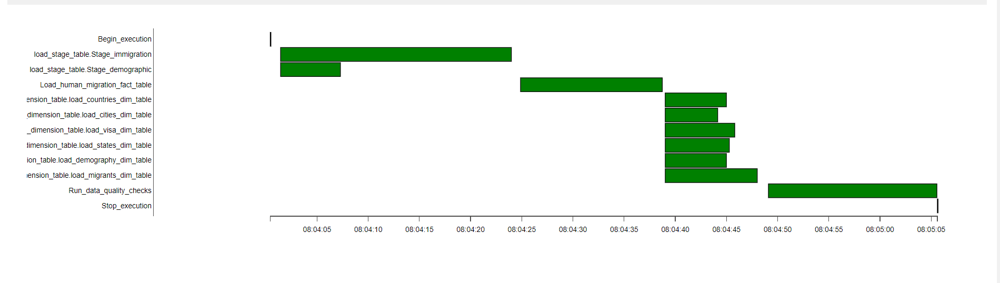

# Data Engineerning Capstone Project

## Project Summary
The nantional Travel and Tourism Office (NTTO) of USA goverment manages the ADIS/I-94 visitor arrivals program in cooperation with the Department of Homeland Security. 
The project is to build a data lake for support analytics department of US and information about demography all over the world. Query information from exracted table from two datasource 

### About Dataset
1. I94Immigration : This data was created by US National Travel and Tourism Office. [This](https://travel.trade.gov/research/reports/i94/historical/2016.html) is where data come from.
2.  U.S City Demographic Data: This data comes from OpenSoft. You can read more about it [here](https://public.opendatasoft.com/explore/dataset/us-cities-demographics/export/).

### Gathering data
The data go with code along the way so I create them for easy processing data
- i94addrl.txt: Code for state
- i94prtl.txt: Code for city
- i94mode: Code for mode transportation
- i94cntyl: Code for countries

### Data Model
 Using star schema:
 
 I use start schema because it can used for bussiness to easy to understand and analyze, Not sure that will be more advanage to another schema, cause I am not an analysist.

Include 1 fact and 6 dimenstion table:
- Fact table: human_migration

- Dimension table:
    + migrants:
    
    + demography:
    
    + visa:
    
    + states:
    
    + cities:
    
    + countries:
    

    

### Technology usage:
- Apache airflow: Using apache airflow help to gather data monthly without we have to do it by ourself.
- Pyspark: To processing large dataset, we could use spark for worse scenario if data is going to bigger
- Amazon S3: Store raw data and processing data, loading to relational dastabase
- Amazon Redshift: A data warehouse soluditon Redshift database could help us reduce waste time to wait for the result of the query.

### Data update frequently
- The immigration pretty big, then we should update monthly and all data have linking togther then demography should be updated too.

### Future Design Consideration
- If the data get increased by 100x:
    + Spark standalone server mode if not process at 100x dataset, we could use **AWS EMR** which is distributed data cluster processing for large dataset and redshift cluster using elastic resize that can handle for more storage.
- The pipelines would be run on a daily basis by 7 am every day.
    + Apache airlfow could be use to build ETL data pipline to regularly update the date and populate for report. Apche airflow which is have config for us to modify
- The database needed to be accessed by 100+ people.
    + AWS Redshift could handle for us

### Result:

